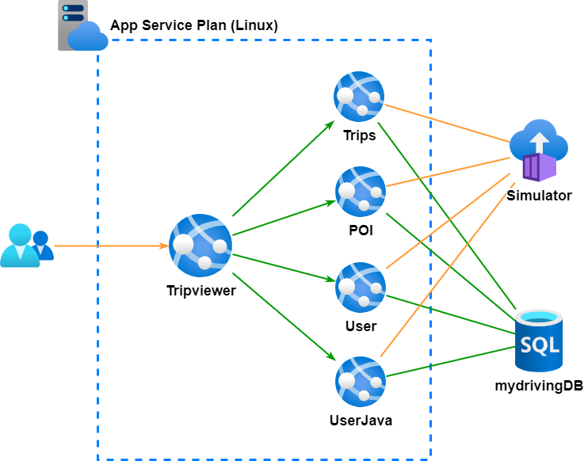

# DevOps OpenHack

During this OpenHack, your team will implement DevOps practices to achieve Secure Zero Downtime Deployment targeting an application and APIs hosted in <a href="https://docs.microsoft.com/en-us/azure/app-service/overview#app-service-on-linux" target="_blank">Azure App Service on Linux</a>, which is hosting a series of Linux-based containers.

Any resemblance to actual scenarios, issues, or pain points that you are facing is **not** purely coincidental and definitions of the challenges presented to you during this event are inspired by real life.

## OpenHack lab environment provisioning

> **Attention!** No resources or configurations are prepared in advance. You or your team are responsible for the GitHub or Azure DevOps provisioning!

Deployment steps and scripts are located at [aka.ms/OpenHackBYOS](https://aka.ms/OpenHackBYOS) under **devops** folder. This OpenHack is tested and achievable using GitHub or Azure DevOps.

> **NOTE:** Choose GitHub or Azure DevOps and deploy only one lab environment based on your team's decision!

## Context

Your team is the IT team of a fictitious insurance company. The company is offering its customers the ability to evaluate their driving skills. A mobile application collects the data from the car and sends them to a set of APIs, which consider the trip that has just been completed. Your customers can connect to a web application that uses the same APIs to review their trips and driving scores. Any downtime of the APIs would significantly impact your business.

**Your mission is to update the infrastructure and APIs to incorporate business requirements while keeping the application functional.**

Your team's success depends on your ability to perform those updates and minimize the downtime of your application after your release production environment.

## Architecture

The application is composed of :

- **Tripviewer** (.NET Core): The team website your customers use to review their driving scores and trips is being simulated against the APIs.
- **Trips** (Go): The trips API is where the mobile application sends the trip data from the OBD device to be stored.
- **POI**: (.NET Core) The POI (Points Of Interest) API is collecting the points of the trip when a hard stop or hard acceleration has detected.
- **User** (Node): The user profile API is used by the application to read the user's information.
- **UserJava** (Java): The user-java API is used by the application to create and modify the users.

A simulator runs throughout the entire event after you spin up infrastructure to send your APIs the data your users generate in real life.

The following schema shows the overall architecture:

### Keep the lights up

There is no "maintenance window". Your goal throughout this OpenHack is to implement a strategy for a zero-downtime deployment.

## Make decision

Select the tooling that best fits your team's skills or learning plans (GitHub or Azure DevOps). To provision lab environment and do initial DevOps platform setup, go to **OpenHack lab environment provisioning** section.

## Cheat sheet

In this section, you will find a list of information to help you get started with the technologies used during the DevOps OpenHack.

### Obtaining the credentials of your team environment

1. Navigate to the **OPEN HACK ENVIRONMENT** tab.
2. The usernames and passwords provided can be used to access your Azure subscription.

### Database credentials

The existing Azure SQL Database credentials are as follows:

- Username: **demousersa**
- Password: **demo!P@55w0rd123**

### DevOps tool references

General references to common things used for almost every challenge

#### GitHub References

General GitHub references to common things used for almost every challenge.

- <a href="https://docs.github.com/en/actions/learn-github-actions/workflow-syntax-for-github-actions" target="_blank">Workflow syntax for GitHub Actions</a>
- <a href="https://docs.github.com/en/actions/learn-github-actions/environment-variables" target="_blank">Environment variables</a>
- <a href="https://docs.github.com/en/actions/learn-github-actions/contexts" target="_blank">Contexts</a>
- <a href="https://docs.github.com/en/actions/learn-github-actions/expressions" target="_blank">Expressions</a>
- <a href="https://docs.github.com/en/actions/learn-github-actions/events-that-trigger-workflows" target="_blank">Events that trigger workflows</a>
- <a href="https://docs.github.com/en/actions/learn-github-actions/workflow-commands-for-github-actions" target="_blank">Workflow commands</a>

#### Azure DevOps References

General Azure DevOps references to common things used for almost every challenge.

- <a href="https://docs.microsoft.com/en-us/azure/devops/pipelines/yaml-schema" target="_blank">Azure Pipelines YAML schema reference</a>
- <a href="https://docs.microsoft.com/en-us/azure/devops/pipelines/build/variables?view=azure-devops&tabs=yaml" target="_blank">Use predefined variables</a>
- <a href="https://docs.microsoft.com/en-us/azure/devops/pipelines/process/conditions?tabs=yaml&view=azure-devops" target="_blank">Specify conditions</a>
- <a href="https://docs.microsoft.com/en-us/azure/devops/pipelines/process/variables?view=azure-devops&tabs=yaml%2Cbatch" target="_blank">Define variables</a>
- <a href="https://docs.microsoft.com/en-us/azure/devops/pipelines/repos/azure-repos-git?view=azure-devops&tabs=yaml#ci-triggers" target="_blank">CI triggers</a>
- <a href="https://docs.microsoft.com/en-us/azure/devops/pipelines/repos/azure-repos-git?view=azure-devops&tabs=yaml#pr-triggers" target="_blank">PR triggers</a>

## Command line references

The latest [GitHub CLI version can be found here](https://cli.github.com) if a suitable version 2.5.0 or later is not already installed.

The latest [Azure CLI version can be found here](https://docs.microsoft.com/en-us/cli/azure/install-azure-cli?view=azure-cli-latest) if a suitable version 2.33.1 or later is not already installed.

The latest [Terraform can be found here](https://www.terraform.io/downloads.html) if a suitable version 1.1.5 or later is not already installed.

## Glossary

Common term definitions:

### Azure App Service on Linux

[Azure App Service](https://docs.microsoft.com/en-us/azure/app-service/overview) is a fully managed compute platform that is optimized for hosting websites and web applications. Customers can use [App Service on Linux](https://docs.microsoft.com/en-us/azure/app-service/overview#app-service-on-linux) to host web apps natively on Linux for supported application stacks.

### ACR - Azure Container Registry

This is the private registry for Docker containers in Azure. The containers stored in an [Azure Container Registry](https://docs.microsoft.com/en-us/azure/container-registry/container-registry-intro) can only be accessed by the resources that have been granted access.

### ACI - Azure Container Instances

[Azure Container Instances](https://docs.microsoft.com/en-us/azure/container-instances/container-instances-overview) offers the fastest and simplest way to run a container in Azure, without having to manage any virtual machines and without having to adopt a higher-level service.

Azure Container Instances is a great solution for any scenario that can operate in isolated containers, including simple applications, task automation, and build jobs.

### Azure SQL Database

[Azure SQL Database](https://docs.microsoft.com/en-us/azure/azure-sql/database/sql-database-paas-overview) is a fully managed platform as a service (PaaS) database engine that handles most of the database management functions such as upgrading, patching, backups, and monitoring without user involvement.

### GitHub

[GitHub](https://github.com) is a web-based version-control and collaboration platform for software developers. GitHub simplifies the process of working with other people and makes it easy to collaborate on projects.

### Azure DevOps

[Azure DevOps](https://docs.microsoft.com/en-us/azure/devops/user-guide/what-is-azure-devops?view=azure-devops) provides developer services for support teams to plan work, collaborate on code development, and build and deploy applications. Azure DevOps supports a culture and set of processes that bring developers and project managers and contributors together to complete software development. It allows organizations to create and improve products at a faster pace than they can with traditional software development approaches.

### Docker container

A [container](https://www.docker.com/resources/what-container) is a standard unit of software that packages up code and all its dependencies so the application runs quickly and reliably from one computing environment to another. A Docker container image is a lightweight, standalone, executable package of software that includes everything needed to run an application: code, runtime, system tools, system libraries and settings.

Container images become containers at runtime and in the case of Docker containers - images become containers when they run on Docker Engine (and in the case of this application and its APIs - Docker Engine running in Azure App Service on Linux). Available for both Linux and Windows-based applications, containerized software will always run the same, regardless of the infrastructure. Containers isolate software from its environment and ensure that it works uniformly despite differences for instance between development and staging.
