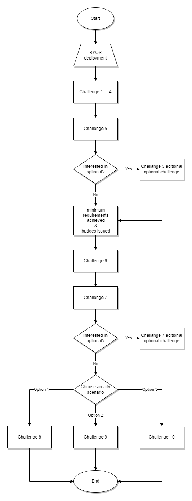
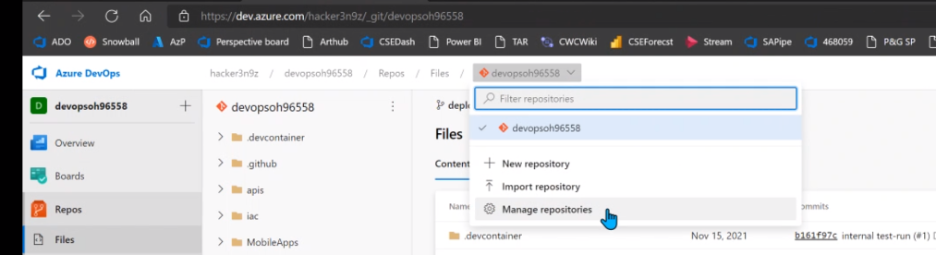
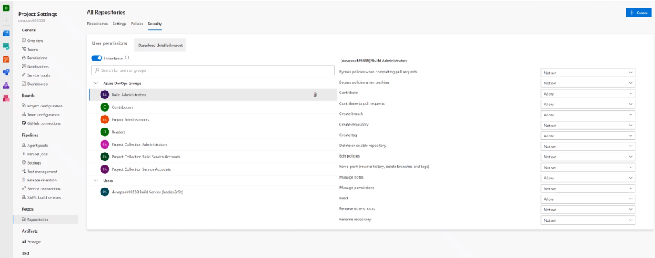

# Notes for Coaches

This document is a set of references and notes that the coaches of the DevOps OpenHack can use at each stage of the event.

## Environment setup

- **Azure Accounts**: The attendees have been provided a specific account for the event. It does not apply to the BYOS delivery model - it's only for Opsgility managed delivery. **It is highly recommended that they use their browser InPrivate/Incognito mode.**

- **GitHub Accounts**: The attendees can use their own GitHub accounts. If they do not want to, they have to setup a new one on their own.

- **GitHub Enterprise Organization**: Dedicated GitHub Enterprise Organization has been created upfront with all enterprise features and an Advanced Security license. Coach has to invite attendees to the GitHub Enterprise Organization as standard members before GitHub Lab Environment deployment has been triggered.

- **Azure DevOps Organization**: The attendees have to create a new Azure DevOps organization dedicated only for the OpenHack. The participants will have to add the hackers' accounts of their team. Each Azure DevOps has a subscription limit of 5 free accounts, and the accounts shall be set using the **Basic** access level.

- **Azure DevOps**: You can suggest to the teams to rename their accounts from Hacker1 etc., to their names to make the rest of the event easier. For example, when they will create PRs, they will know who created them. It does not apply to the BYOS delivery model - it's only for Opsgility managed delivery.

## Coaching Tips and Tricks

In this section, you will find non-technical related stuff like general structure of the event, Do's and Don'ts, how to coach, etc. Follow this guide: [Coaching Tips and Tricks](COACHING_TIPS_AND_TRICKS.md)

## Challenges flow

- Challenge 5 is a minimum challenge requirement to achieve Badge/TSI credit.
- Challenge 5 & 7 have optional additional challenges - it's recommended only for experienced teams where all participants want to learn more advanced scenarios.
- After Challenge 7, the team can choose the favorite path based on learning needs.



## Do not use two-factor auth with the hacker Azure test ID's

Tell the attendees to click the "skip for 14 days" link after the initial sign-in to the Azure portal or DevOps portal. Two-factor auth can cause unintended behavior between the hacker accounts and MSFT accounts.

## GitHub

[GitHub Codespaces](https://github.com/features/codespaces) is not mentioned anywhere in the OpenHack content, but feel free to advise your team they can try this feature if they are interested.

## Challenge 0 (BYOS)

It might be too difficult for attendees with limited CLI & scripting experience.

The coach should evaluate the skill level of the team and either help with the provisioning or do it by themself and share in real-time all the steps with attendees.

## Challenge 1

Before creating a project lifecycle and task board, you must deploy resources and applications following the steps in the **Overview** markdown.

This challenge is about creating a project lifecycle and a task board.

Everybody in the team should be engaged, and if you see anyone left aside, you should facilitate their integration into the team.

**Coaches, if your team wants to use Microsoft Teams, you will need to create a team and invite the Opsgility accounts to that team. It does not apply to the BYOS delivery model - it's only for Opsgility managed delivery.**

If your team chooses an app like Teams or Slack, you can suggest the plugins for integration. It is not part of the challenge itself, but nice to have.

- [GitHub & Teams](https://teams.github.com/)
- [GitHub & Slack](https://slack.com/apps/A01BP7R4KNY-github)
- [Azure DevOps & Teams](https://marketplace.visualstudio.com/items?itemName=ms-vsts.vss-services-teams)
- [Azure Boards & Slack](https://slack.com/apps/AKR9QDD1D-azure-boards)
- [Azure Repos & Slack](https://slack.com/apps/AKPEA4W4Q-azure-repos)
- [Azure Pipelines & Slack](https://slack.com/apps/AFH4Y66N9-azure-pipelines)

Pair programming is strongly recommended because it is more efficient and facilitates teamwork and learning. [VScode LiveShare](https://docs.microsoft.com/en-us/visualstudio/liveshare/) allows the team to pair-program from their personal editors.

## Challenge 2

Quick and easy challenge, but can present a good opportunity to talk about branch restrictions and what's the impact on development velocity. Rules too strict can significantly slow the project down and the tax of PR reviews is not negligible. On the other hand there are significant benefits to protecting the `main` branch from unsupervised commits.

### ADO

There's no expectation to do anything with code in this challenge.

The solution here is different from GitHub (below), because it allows to enforce squash merging on a branch level.

### GitHub

Beware that when specifying paths in the `CODEOWNERS` file, all characters matter - especially `/` and `*`.

- `/apis/*` means files in just the one folder, `/apis/` means this folder and subfolders.
- `README.md` means all readme files in any folder, `/README.md` means only the root readme.
- `apis/` means any file in any apis directory anywhere in the repository.

See [examples](https://docs.github.com/en/repositories/managing-your-repositorys-settings-and-features/customizing-your-repository/about-code-owners#example-of-a-codeowners-file) for more details.

If there are syntax errors in the file, they **will not be detected** and the code review rules will not work.

Observe if the team decides to enforce squash merging on the repository level. The solution is acceptable without it, but encourage them to think about both options.

## Challenge 3

The Bicep path is more complicated than Terraform. If the team does not have experience in ARM and Infrastructure as Code, then Terraform is highly recommended.

Be aware of where the participants are running the deployment scripts from i.e desktop or az pipeline make sure there are az login commands executed to ensure proper deployment.

If the team name is hardcoded, then RESOURCES_PREFIX is no longer required.

The web apps might take some time to spin up especially the java one. If the pipeline/workflow fails to get the sites health endpoints during the test step, run the following code replacing `<ProjectName>` with the name of your project:

```shell
./smokeTest.ps1 -HostNames <ProjectName>poi.azurewebsites.net/api/healthcheck/poi,<ProjectName>trips.azurewebsites.net/api/healthcheck/trips,<ProjectName>userjava.azurewebsites.net/api/healthcheck/user-java,<ProjectName>userprofile.azurewebsites.net/api/healthcheck/user`
```

or use your browser to access the above endpoints. Once the websites return a valid json re-run the pipeline/workflow.

When re-running the Terraform deployment, make sure you also delete the terraform.tfstate file in the Azure storage account in the state resource group.

If there are already resources present in the target resource groups with the same names as the new resources (for instance because they were deployed previously with Bicep or Azure Portal), you'll get an error like this: \*Error: A resource with the ID "/subscriptions/_\*\*/resourceGroups/devopsoh09248rg" already exists - to be managed via Terraform this resource needs to be imported into the State._ The easiest thing is to remove all existing resources and deploy again.

### ADO

Add Pipeline permissions to the production environment, grant access permissions to all pipelines in the service connection (See [Manage service connections](https://docs.microsoft.com/en-us/azure/devops/pipelines/library/service-endpoints?view=azure-devops&tabs=yaml)), and get the [Azure Pipelines Terraform Task extension](https://marketplace.visualstudio.com/items?itemName=charleszipp.azure-pipelines-tasks-terraform).

You will need to permit the pipeline to access additional resources during the initial run of each pipeline.

### GitHub

If using a Personal Access Token (PAT) to login, make sure it has the `workflow` permissions - otherwise GitHub will refuse a commit which creates Actions.

All workflows can be triggered manually, which is good for development and testing, but don't forget to validate the branch, PR and path conditions.

## Challenge 4

Encourage the use of a CI pipeline per API source repo. Smaller pipelines will run faster to provide a quicker feedback loop and partition the code builds for added isolation. The build definition can then be part of each api code base.

Make sure the main branch is not included in the CI pipeline.

For the part of the challenge that requires adding a comment to the PR for failed builds in ADO version ensure that the Build Service (hacker) has "contribute to pull requests" set to allow.





## Challenge 5

When using Azure Container Registry, there are two ways to build the Docker image: on the build agent or using ACR Tasks. Both approaches are feasible, just encourage the team to discuss implications of each of them and make an informed decision.

## Challenge 7

Provided challenge does not use Managed Identities because of application architecture but having discussion about Managed Identity usage instead of keys/passwords (benefits, implementation, etc.) is a good idea to start with team members.

> **NOTE:** If your team consists only Microsoft employees, and they have chosen Azure DevOps, then the preferred way is Cred Scan.

## Challenge 8

If the Team decided to use 3rd party GitHub Apps like WhiteSource Bold, someone with GitHub Organization owner right has to approve that request. Each Coach has admin permission and can do that for Team.

## Challenge 9

A sample JMX file has been provided in the teams repo resources section. This file is already parameterized and accepts uris for each API.

Teams can create a new Azure Load Testing Resource and create a test. In there, please ensure they add parameters with each of the endpoints for each api. This should be the domain only as the path is specified in the test.

The names of the parameters can be found in the MyDrivingTest.jmx file in the User Defined Variables section.

For example the User Java parameter name is UserJavaURI.

```xml
 <Arguments guiclass="ArgumentsPanel" testclass="Arguments" testname="User Defined Variables" enabled="true">
        <collectionProp name="Arguments.arguments">
          <elementProp name="UserJavaUri" elementType="Argument">
            <stringProp name="Argument.name">UserJavaUri</stringProp>
            <stringProp name="Argument.value">${__BeanShell(System.getenv("UserJavaUri"))}</stringProp>
            <stringProp name="Argument.metadata">=</stringProp>
          </elementProp>
        ...
        </collectionProp>
      </Arguments>
```
