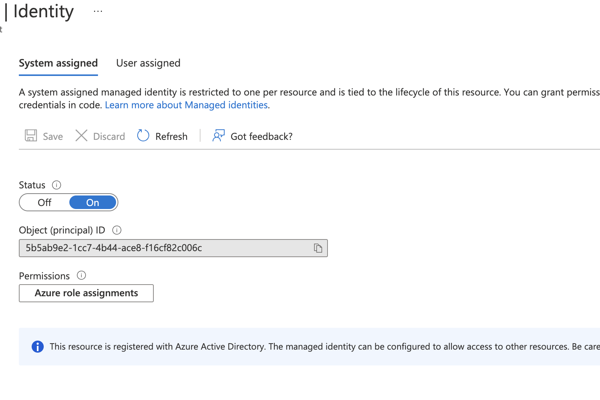
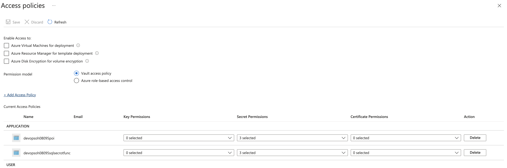
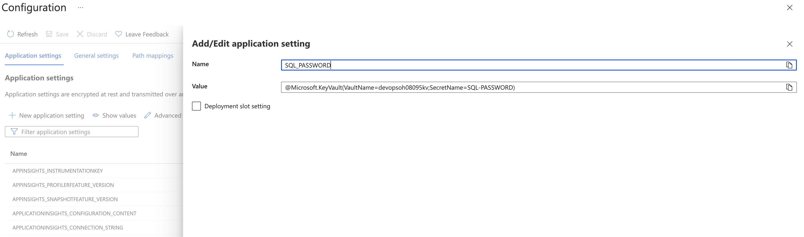
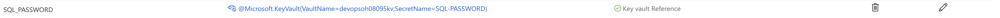
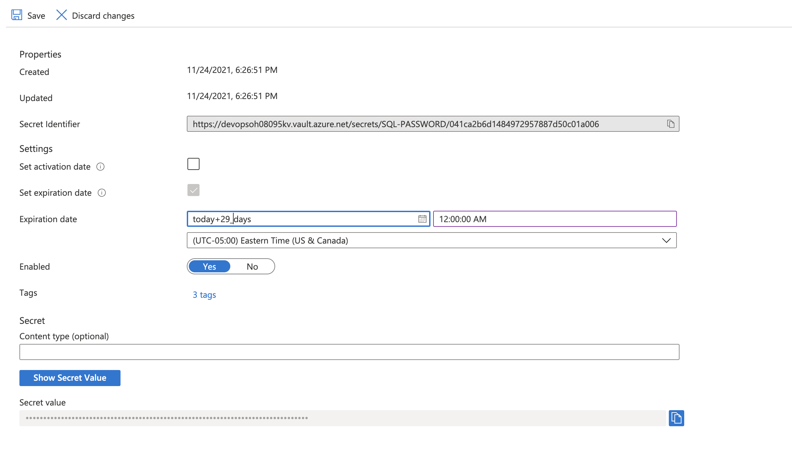
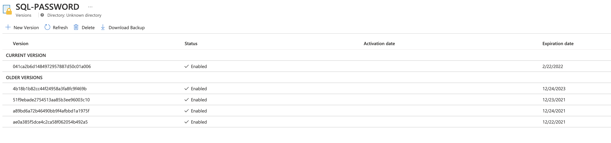

# Challenge 7

## Scan for secrets

Real secrets to find are located in two files: `iac/terraform/locals.defaults.tf` and `iac/bicep/variables.json`. The rest are false-positive and have to be suppressed/allowlisted.

> Because secrets are in Terraform and Bicep files, and your team has chosen the IaC path at the beginning of the OpenHack, it's OK to mark it as a false-positive for opposite IaC to your team's choice.

### CredScan

TODO

### Gitleaks

TODO

#### Custom rules in TOML

TODO

## Move secrets to Azure Key Vault

Follow this guide: [https://docs.microsoft.com/en-us/azure/app-service/app-service-key-vault-references](https://docs.microsoft.com/en-us/azure/app-service/app-service-key-vault-references)

## Remove secrets from the source code

1. Remove secrets from the IaC source code
1. Update IaC deploy pipeline
   1. Connect Variable Group to Key Vault or query Key Vault using a task
   2. Pass secret as a parameter
      - Bicep: `sqlServerAdminPassword`
      - Terraform: `mssql_server_administrator_login_password`

## (optional) Secret Rotation

The solution for the Secret Rotation will require the team to create a KeyVault with the name {RESOURCES_PREFIX}kv.  

`az keyvault create --name {RESOURCES_PREFIX}kv -g {RESOURCES_PREFIX}rg`  

They will then need to create the ado pipeline to deploy the dependent resources listed below for the rotation to work. The pipeline is located in the team's repo (`support/sqlsecretrotation/.azure-pipelines/pipeline.bicep.sqlsecrot.yml`).

- {RESOURCES_PREFIX}sqlsecrotrg
- {RESOURCES_PREFIX}sqlsecrotst
- {RESOURCES_PREFIX}sqlsecrotplan
- {RESOURCES_PREFIX}sqlsecrotfunc
- {RESOURCES_PREFIX}sqlsecrotappi
- EventGrid System Topic in the {RESOURCES_PREFIX}rg

 Once the Keyvault is created and the supporting services are created using the ado pipline they will need to create the secret and add the tags properly.

`az keyvault secret set --name SQL-PASSWORD --vault-name {RESOURCES_PREFIX}kv --value "demo!P@55w0rd123" --tags "CredentialId=demousersa" "ProviderAddress={MydrvingDB_Azure_ResourceID}" "ValidityPeriodDays=90"`

Finally configure the poi app service to read the password value from the secret in keyvault with Key Vault references for App Service.

- Enable system assigned identity on the poi app service.

- Add Access Policy in Keyvault {RESOURCES_PREFIX}kv for the system assigned identity for the poi app service.

- Add keyvault reference to the poi app service application settings.
    @Microsoft.KeyVault(VaultName={RESOURCES_PREFIX}kv;SecretName=SQL-PASSWORD)

### Testing

- Set the secret to expire within 29 days of the current date.

- Save the change and wait for the rotation to happen. This may take a few minutes to complete.
- Once the rotation is complete you should see multiple versions of the secret one current and many historical depending on the number of time tested

- Validate the poi/api endpoint for the app service is still service data.
